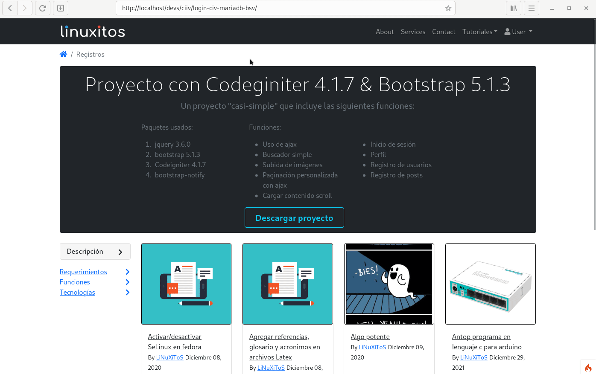
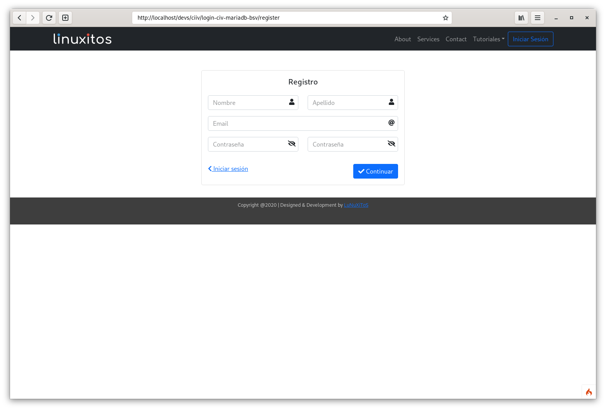
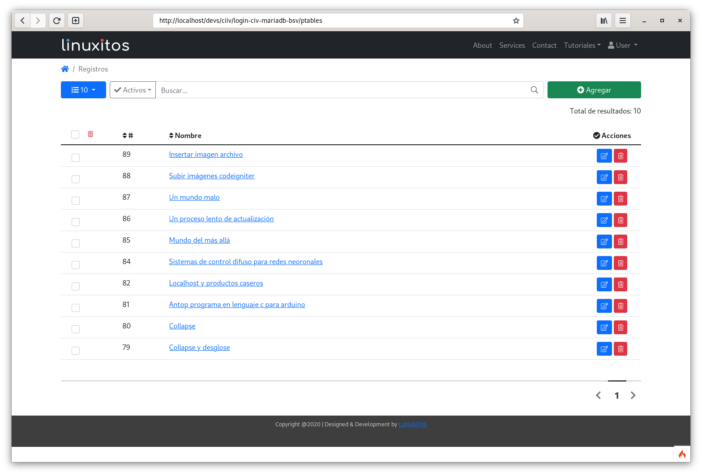
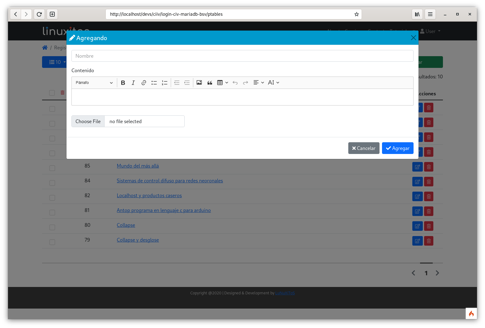
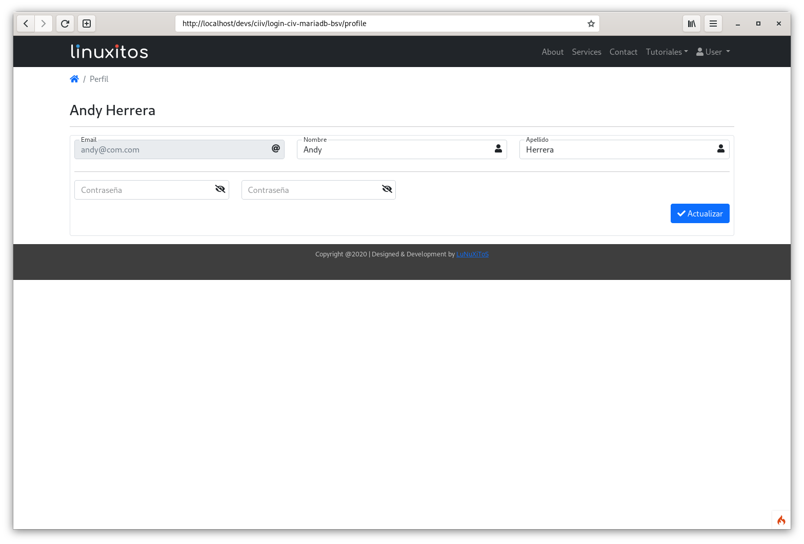

# Codeigniter 4.1.7 & Bootsatrp 5.1.3 & PHP 8.1

## Descripción
Un proyecto desarrollado en las tecnologías mencionados, es un ejemplo que permite probar inicio de sesión,
registro de usuarios, cambio de contraseña. También permite la captura de post, actualización, eliminación,

Un búsqueda simple, subir archivo imágenes, el uso de ajax, scroll infinito para cargar elementos.

## Características
================
- Boostrap 5.1.3
- PHP 8.1.1
- Codeigniter 4.1.7
- Búsqueda en tablas directo a base de datos
- Filtro usando menú desplegable
- Subida de imágenes/archivos
- Scritp de la base de datos
- Drag & Drop
- Login
- Reset password
- Registro de usuarios
- Alta de registros por usuario
- Sección de perfil de usuario

## Capturas

## Instalar

* Tener instaldo XAMPP, WAMPP, LAMPP, o PHP > 8.0
* Descargar el proyecto y moverlo a www o htdocs
* Crear la base de datos con el script incluido
* Renombrar env a .env y modificar la url del proyecto y conexión a BD
* Abrir la url del proyecto y probar

#### Developed By
----------------
 * linuxitos - <contact@linuxitos.com>